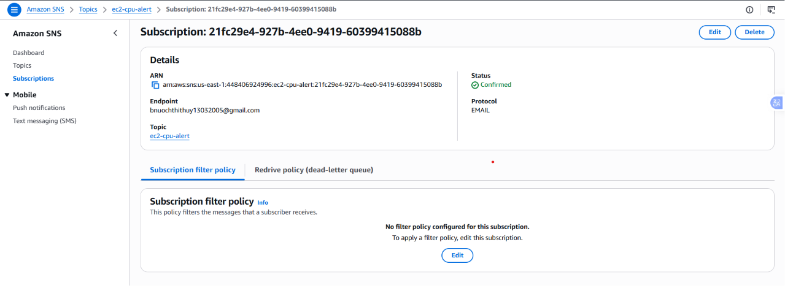
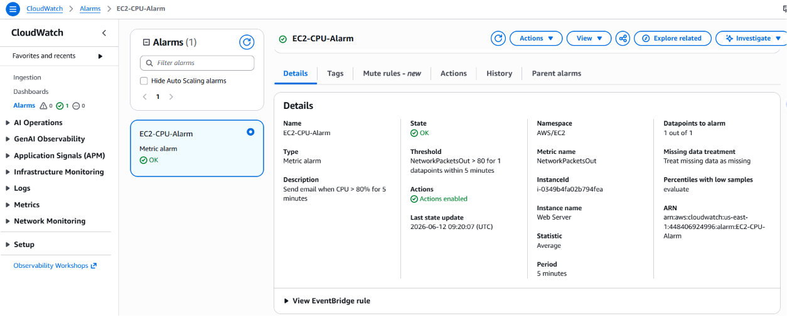

# AWS CloudWatch EC2 CPU Email Alert Lab

Lab nay tao SNS Topic, dang ky email nhan canh bao, va tao CloudWatch Alarm cho EC2 khi CPU vuot 80% trong 5 phut.

## Kien truc

```text
EC2 CPUUtilization metric
    -> CloudWatch Alarm: CPU > 80%, period 300s, evaluation 1/1
    -> SNS Topic
    -> Email subscription
    -> Quan tri vien nhan email canh bao
```

## Tai nguyen duoc tao

- `aws_sns_topic.cpu_alerts`: SNS Topic nhan tin hieu canh bao.
- `aws_sns_topic_subscription.email`: dang ky email nhan thong bao.
- `aws_cloudwatch_metric_alarm.ec2_cpu_high`: alarm theo doi metric `AWS/EC2 CPUUtilization`.

## Chay lab

Tao file cau hinh tu file mau:

```powershell
cd D:\gitOps\gitops\aws-cloudwatch-cpu-alert
Copy-Item .\terraform.tfvars.example .\terraform.tfvars
notepad .\terraform.tfvars
```

Sua cac gia tri bat buoc:

```hcl
region             = "us-east-1"
aws_profile        = "default"
ec2_instance_id    = "i-0349b4fa02b794fea"
notification_email = "email-cua-ban@example.com"
```

Apply Terraform:

```powershell
terraform init
terraform plan -out tfplan
terraform apply tfplan
```

Sau khi apply, mo email va bam link `Confirm subscription` cua AWS SNS. Neu chua confirm, SNS se khong gui email canh bao.

## Cau hinh dang dung trong lab

Lab hien tai dang monitor EC2 sau:

```text
Region: us-east-1
Instance ID: i-0349b4fa02b794fea
Public IPv4: 98.92.31.148
Alarm name: cloudwatch-cpu-alert-lab-i-0349b4fa02b794fea-cpu-high
SNS topic: cloudwatch-cpu-alert-lab-cpu-alerts
```

Instance nay co `KeyName = None`, nen khong SSH bang file `.pem`. De tao CPU load, dung AWS Console:

```text
EC2 -> Instances -> chon i-0349b4fa02b794fea -> Connect -> EC2 Instance Connect -> Connect
```

## Cau hinh Alarm

Alarm dang dung cau hinh dung voi yeu cau lab:

- Metric: `AWS/EC2 CPUUtilization`
- Dimension: `InstanceId = var.ec2_instance_id`
- Statistic: `Average`
- Dieu kien: `GreaterThanThreshold`
- Threshold: `80`
- Period: `300` giay, tuc 5 phut
- Evaluation: `1 out of 1`
- Alarm action: gui den SNS Topic
- OK action: gui email khi trang thai tro lai `OK`

## Kiem tra bang cach tao CPU load

Mo terminal vao EC2 bang `EC2 Instance Connect`, cai cong cu stress va tao tai CPU.

Amazon Linux 2023:

```bash
sudo dnf install -y stress-ng
stress-ng --cpu 0 --timeout 420s --metrics-brief
```

Amazon Linux 2:

```bash
sudo yum install -y stress
stress --cpu 0 --timeout 420
```

Ubuntu:

```bash
sudo apt-get update
sudo apt-get install -y stress-ng
stress-ng --cpu 0 --timeout 420s --metrics-brief
```

Cho hon 5 phut de CloudWatch nhan du metric. Khi CPU trung binh vuot 80%, alarm chuyen sang `ALARM` va SNS gui email. Khi dung stress va CPU giam lai, alarm se chuyen ve `OK` va gui email neu `send_ok_notification = true`.

## Lenh kiem tra

Xem output Terraform:

```powershell
terraform output
```

Kiem tra subscription da confirm hay chua:

```powershell
aws sns list-subscriptions-by-topic --topic-arn $(terraform output -raw sns_topic_arn)
```

Kiem tra trang thai alarm:

```powershell
aws cloudwatch describe-alarms --region us-east-1 --alarm-names $(terraform output -raw cloudwatch_alarm_name)
```

## Evidence da chup

Cac anh evidence hien co trong thu muc `evidence/`:

| File | Noi dung chung minh |
| --- | --- |
| `01_SNS_Subscription_Confirmed.png` | SNS Topic co email subscription da duoc confirm. |
| `02_CloudWatch_Alarm_Config_CPU_80_5min.png` | CloudWatch Alarm cau hinh metric `CPUUtilization`, nguong CPU > 80%, period 5 phut. |
| `confirm emal.png` | Email confirm subscription tu AWS SNS. |

### SNS subscription confirmed



### CloudWatch alarm config CPU 80% trong 5 phut



### Email confirm SNS


## Evidence can chup

Can chup toi thieu 4 hinh sau de nop lab:

1. SNS subscription da confirm:

```text
AWS Console -> us-east-1 -> SNS -> Topics -> cloudwatch-cpu-alert-lab-cpu-alerts -> Subscriptions
```

Can thay email subscription o trang thai `Confirmed`.

2. CloudWatch alarm config:

```text
AWS Console -> us-east-1 -> CloudWatch -> Alarms -> All alarms
```

Chon alarm:

```text
cloudwatch-cpu-alert-lab-i-0349b4fa02b794fea-cpu-high
```

Can chup duoc cac thong tin:

```text
Metric: CPUUtilization
InstanceId: i-0349b4fa02b794fea
Threshold: CPUUtilization > 80
Period: 5 minutes
Evaluation: 1 out of 1
```

3. CloudWatch alarm `In alarm`:

Sau khi chay `stress-ng` hoac `stress` tren EC2 khoang 5-7 phut, quay lai CloudWatch va chup alarm co state:

```text
In alarm
```

4. Email canh bao `ALARM`:

Mo hop thu email da confirm voi SNS va chup email canh bao CloudWatch gui qua SNS.

Neu co thoi gian, chup them alarm hoac email khi trang thai tro lai `OK` sau khi dung stress.

## Don dep

```powershell
terraform destroy
```

Luu y: file `terraform.tfvars` chua email va instance id rieng cua ban, khong nen commit file nay len Git.
