# W9 Lab Evidence

File này tổng hợp bằng chứng cho API canary rollout, AnalysisTemplate, SLO alert và Alertmanager email routing.

## 1. ArgoCD Quản Lý GitOps Apps

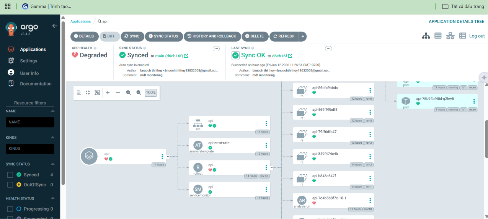

Ảnh `argocd-app.png` chứng minh các ứng dụng GitOps được ArgoCD quản lý từ repo.

Evidence liên quan:

- `kube-prometheus-stack`: cài Prometheus, Alertmanager và Prometheus Operator.
- `api-monitoring`: quản lý rule monitoring/API alert qua Git.
- `api`: quản lý Rollout API canary qua Git.

## 2. Kube Prometheus Stack

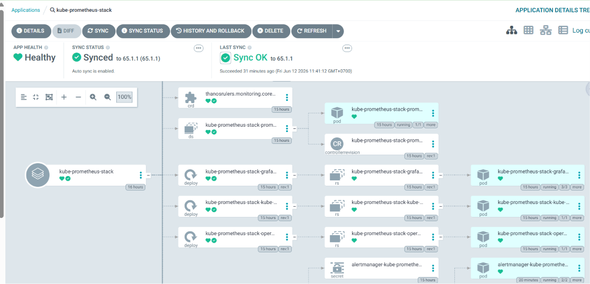

Ảnh `kube-prometheus-stack.png` chứng minh monitoring stack đã được triển khai qua ArgoCD.

Manifest liên quan:

```text
argocd/apps/kube-prometheus-stack.yaml
```

Stack này cung cấp:

- Prometheus để scrape metric.
- Alertmanager để gửi alert.
- Prometheus Operator để quản lý `ServiceMonitor` và `PrometheusRule`.

## 3. API Monitoring App

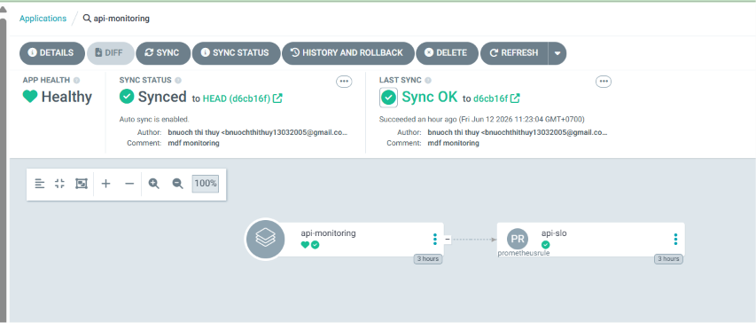

Ảnh `api-monitoring.png` chứng minh các rule monitoring của API được quản lý qua ArgoCD.

Manifest liên quan:

```text
argocd/apps/api-monitoring.yaml
k8s-api/monitoring/prometheus-rule.yaml
```

## 4. Rollout API

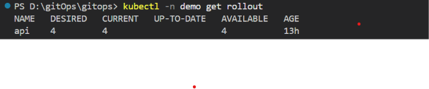

Ảnh `get-rollout.png` chứng minh `Rollout/api` tồn tại trong namespace `demo`.

Lệnh kiểm chứng:

```powershell
kubectl -n demo get rollout api
```

Manifest liên quan:

```text
k8s-api/api.yaml
```

Rollout dùng canary strategy:

```yaml
steps:
  - setWeight: 25
  - analysis:
      templates:
        - templateName: api-error-rate
  - setWeight: 50
  - pause:
      duration: 30s
  - setWeight: 100
```

## 5. AnalysisRun Fail Khi Metric Vượt Ngưỡng

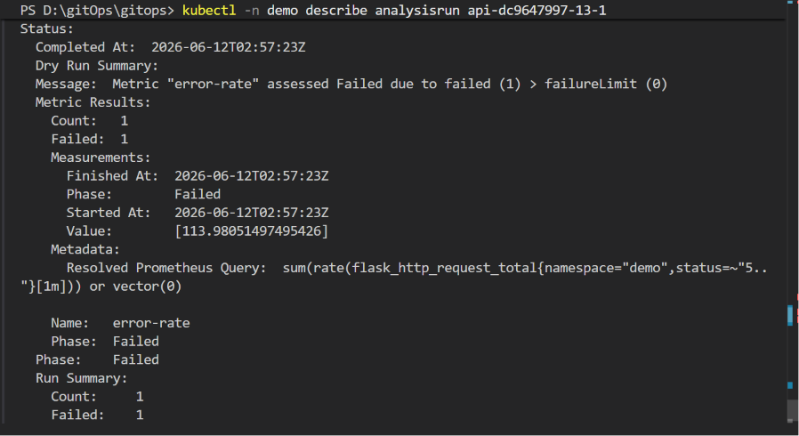

Ảnh `analysis-failed.png` chứng minh `AnalysisRun` fail vì metric `error-rate` vượt ngưỡng.

Lệnh kiểm chứng:

```powershell
kubectl -n demo describe analysisrun <analysisrun-name>
```

Query trong `AnalysisTemplate`:

```promql
sum(rate(flask_http_request_total{namespace="demo",status=~"5.."}[1m])) or vector(0)
```

Điều kiện pass:

```yaml
successCondition: result[0] < 0.01
failureLimit: 0
```

Ý nghĩa:

- Query đo tốc độ HTTP 5xx của API trong 1 phút.
- Rollout chỉ pass nếu error rate nhỏ hơn 1%.
- Vì `failureLimit: 0`, chỉ cần một lần đo fail là AnalysisRun fail.

## 6. Canary Rollout Tự Động Abort

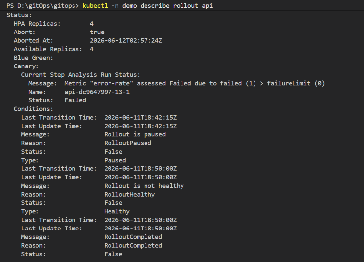

Ảnh `rollout-aborted.png` chứng minh Rollout `api` đã tự động abort khi AnalysisRun fail.

Lệnh kiểm chứng:

```powershell
kubectl -n demo describe rollout api
```

Điểm quan trọng trong evidence:

- `Abort: true`
- Analysis run status `Failed`
- Message báo metric `error-rate` failed vì vượt `failureLimit`

Kết luận: canary version lỗi không được promote tiếp, rollout bị chặn tự động dựa trên metric Prometheus.

## 7. Prometheus Alert Tổng Quan

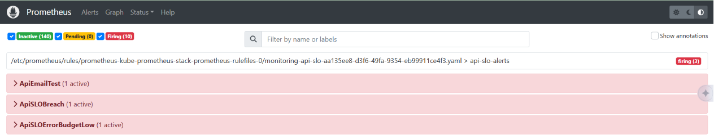

Ảnh `prometheus-alert.png` chứng minh Prometheus đã nhận và đánh giá các alert API.

Mở Prometheus:

```powershell
kubectl -n monitoring port-forward svc/kube-prometheus-stack-prometheus 9090:9090
```

URL:

```text
http://localhost:9090/alerts
```

## 8. Alert Test Email Firing

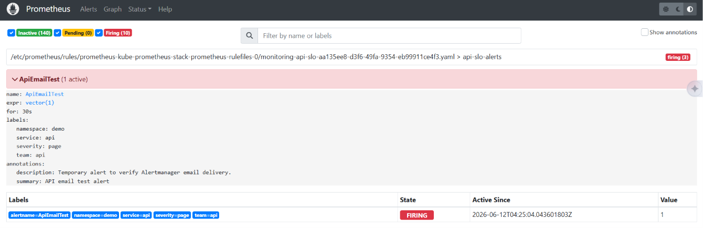

Ảnh `ApiEmailTest-prometheus-alert.png` chứng minh alert test email đang `firing`.

Alert liên quan:

```yaml
alert: ApiEmailTest
expr: vector(1)
for: 30s
```

Alert này dùng để kiểm tra nhanh luồng Prometheus -> Alertmanager -> email.

## 9. API SLO Breach Firing

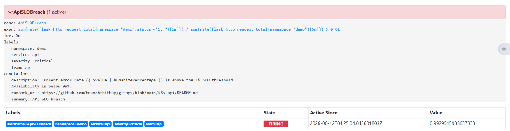

Ảnh `ApiSLOBreach-prometheus-alert.png` chứng minh alert SLO breach đang `firing`.

Query:

```promql
sum(rate(flask_http_request_total{namespace="demo", status=~"5.."}[5m]))
/
sum(rate(flask_http_request_total{namespace="demo"}[5m]))
> 0.01
```

Ý nghĩa:

- Alert firing khi HTTP 5xx error rate lớn hơn 1%.
- Rule yêu cầu tình trạng này kéo dài `5m`.
- Đây là cảnh báo API vi phạm SLO 99%.

## 10. API Error Budget Low Firing

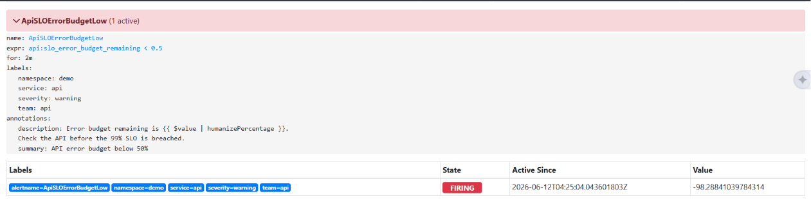

Ảnh `ApiSLOErrorBudgetLow-prometheus-alert.png` chứng minh alert error budget low đang `firing`.

Query:

```promql
api:slo_error_budget_remaining < 0.5
```

Ý nghĩa:

- SLO target là 99%.
- Allowed error rate là 1%.
- Alert firing khi error budget còn dưới 50%.

## 11. Alertmanager Email Routing

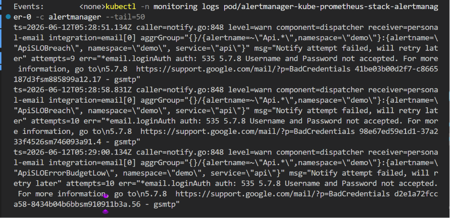

Ảnh `smtp-error-log.png` chứng minh Alertmanager đã route các alert API vào receiver `personal-email`.

Log thể hiện các alert được route:

- `ApiSLOBreach`
- `ApiSLOErrorBudgetLow`
- `ApiEmailTest`

Route Alertmanager match:

```yaml
matchers:
  - namespace="demo"
  - alertname=~"Api.*"
```

Kết quả hiện tại:

```text
535 5.7.8 Username and Password not accepted
BadCredentials
```

Điều này chứng minh route email đã chạy, nhưng Gmail từ chối SMTP do sai credential hoặc App Password chưa hợp lệ.

Để hoàn tất evidence email thành công, cần:

1. Bật 2-Step Verification cho Gmail.
2. Tạo Gmail App Password mới.
3. Cập nhật `SMTP_AUTH_PASSWORD` trong `secrets/.env`.
4. Chạy lại:

```powershell
.\secrets\apply-alertmanager-secret.ps1
kubectl -n monitoring rollout restart statefulset alertmanager-kube-prometheus-stack-alertmanager
```

5. Chụp thêm ảnh email thành công và lưu thành:

```text
Evidence/alert-email.png
```

## 12. Liên Hệ Evidence Với Manifest

### Rollout

Manifest:

```text
k8s-api/api.yaml
```

Evidence:

- `Evidence/get-rollout.png`
- `Evidence/rollout-aborted.png`

### AnalysisTemplate

Manifest:

```text
k8s-api/analysis.yaml
```

Evidence:

- `Evidence/analysis-failed.png`
- `Evidence/rollout-aborted.png`

### ServiceMonitor

Manifest:

```text
k8s-api/servicemonitor.yaml
```

ServiceMonitor scrape endpoint:

```text
/metrics
```

Prometheus dùng dữ liệu này để tính error rate, success rate và alert.

### PrometheusRule

Manifest:

```text
k8s-api/monitoring/prometheus-rule.yaml
```

Evidence:

- `Evidence/prometheus-alert.png`
- `Evidence/ApiEmailTest-prometheus-alert.png`
- `Evidence/ApiSLOBreach-prometheus-alert.png`
- `Evidence/ApiSLOErrorBudgetLow-prometheus-alert.png`

### Alertmanager Email

Manifest/script:

```text
argocd/apps/kube-prometheus-stack.yaml
secrets/apply-alertmanager-secret.ps1
secrets/.env.example
```

Evidence:

- `Evidence/smtp-error-log.png`
- `Evidence/alert-email.png` cần bổ sung sau khi SMTP credential hợp lệ.

## 13. Các Lệnh Kiểm Chứng

Kiểm tra ArgoCD apps:

```powershell
kubectl -n argocd get applications
```

Kiểm tra rollout:

```powershell
kubectl -n demo get rollout api
kubectl -n demo describe rollout api
```

Kiểm tra AnalysisRun:

```powershell
kubectl -n demo get analysisrun
kubectl -n demo describe analysisrun <analysisrun-name>
```

Kiểm tra PrometheusRule:

```powershell
kubectl -n monitoring get prometheusrule api-slo
```

Kiểm tra ServiceMonitor:

```powershell
kubectl -n demo get servicemonitor api
```

Kiểm tra Alertmanager Secret:

```powershell
kubectl -n monitoring get secret alertmanager-private-config
```

Mở Prometheus:

```powershell
kubectl -n monitoring port-forward svc/kube-prometheus-stack-prometheus 9090:9090
```

Mở Alertmanager:

```powershell
kubectl -n monitoring port-forward svc/kube-prometheus-stack-alertmanager 9093:9093
```

Xem log gửi email:

```powershell
kubectl -n monitoring logs pod/alertmanager-kube-prometheus-stack-alertmanager-0 -c alertmanager --tail=100
```
